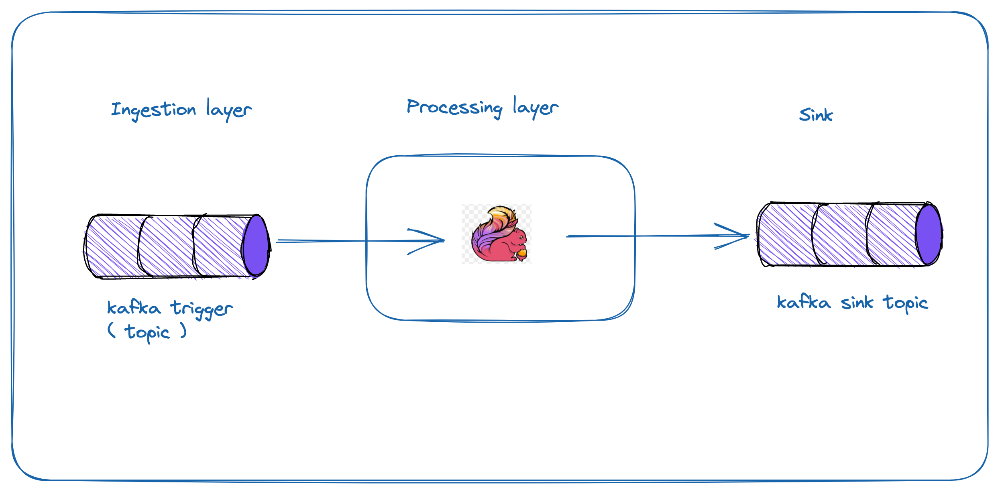

# RankedMatchmaking
This repo will be used to create groups of players with the same rank or one level above or below

## Table of content

+ [About](#about)
+ [Built With](#built-with)
+ [Project Structure](#project-structure)
+ [Getting started](#getting-started)
+ [Architecture](#architecture)
+ [References](#references)

## About

## Built With

* Flink 1.17.1 ( Datastream API )
* Python 3.10

## Project Structure

Define the project structure

## Getting started

How to build this project locally

## Architecture

- High Level Design ( HLD )
  

(Initial draft - https://excalidraw.com/#room=48e25a95292d84603e8e,w7LfaYK6OrZiOdZ70QFh-A)

## References

- https://nightlies.apache.org/flink/flink-docs-release-1.16/docs/dev/datastream/overview/
