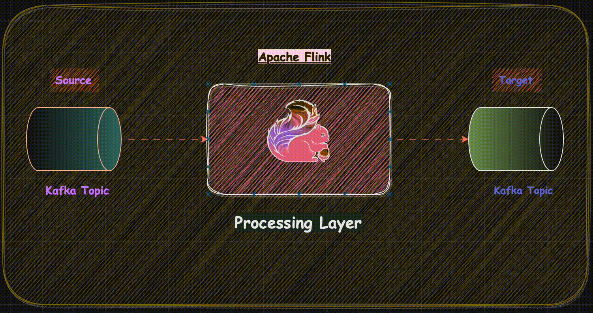

# RankedMatchmaking

## Table of content

+ [About](#about)
+ [Built With](#built-with)
+ [Project Structure](#project-structure)
+ [Architecture](#architecture)
+ [Getting started](#getting-started)
+ [CI/CD](#cicd)
+ [Project Status](#project-status)
+ [References](#references)

## About

This repo will be used to create groups of players with the same rank hierarchy to have fair fights. For example, this repo
will ensure that `GOLD` ranked lobby matches with `GOLD` ranked lobby only. No higher or lower ranked players would be included.

## Built With

* `Apache Flink 1.17.1 ( Datastream API )`
* `Python 3.10`

## Project Structure

The project contains source code written in `Pyflink`.
* source code: under `core` folder

## Architecture

#### High Level Design ( HLD )

## Getting started

1) Clone the RankedMatchmaking repository:  
   `git clone https://github.com/debuggerrr/RankedMatchmaking.git`  

2) Change into the RankedMatchmaking directory:  

   `cd RankedMatchmaking`  

3) Install required dependencies:  
   `python -m pip install .`  

4) Start Kafka Producer:  
   `kafka-console-producer --topic test-topic2 --bootstrap-server localhost:9092`  

5) Submit the PyFlink job:  
   `python core/main/main.py`  

6) Start Kafka Consumer:  
   `kafka-console-consumer --topic test-topic45 --from-beginning  localhost:9092`   

7) Trigger the records from Kafka Producer with input format as `("user_name", "rank")`

## CI/CD
CI workflow is implemented via Github Actions.

It covers the following step:
* `Test`: Source code is tested using `tox`

## Roadmap  

- [Consider one rank level above or below too](https://github.com/debuggerrr/RankedMatchmaking/issues/33)
- [Implement count window](https://github.com/debuggerrr/RankedMatchmaking/issues/31)
- [Fault tolerance](https://github.com/debuggerrr/RankedMatchmaking/issues/30)  

## Project Status
Development phase - Beta version

## References

- [DataStream API](https://nightlies.apache.org/flink/flink-docs-release-1.17/docs/dev/datastream/overview/)  

- [Kafka Connector](https://nightlies.apache.org/flink/flink-docs-release-1.17/docs/connectors/datastream/kafka/)
